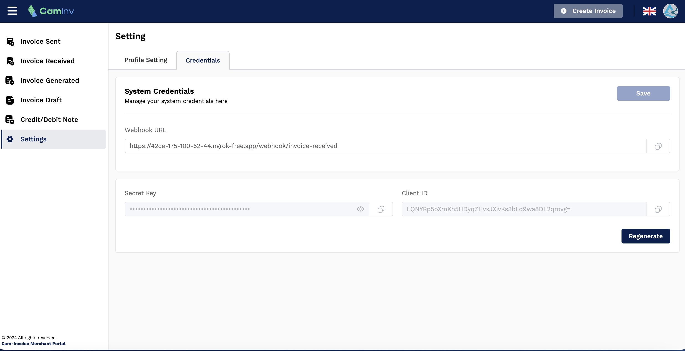

# Getting Start

You can starting **send/receive** invoice via [Caminv](https://caminv-dev-bank.mef.gov.kh/) by register to be a merchant on E-invoice System. 
You need beed sine document attached with this [guide line ](https://caminv-dev-bank.mef.gov.kh/en/businesses#registratoin-guideline)

## Login to get Credential
After the registration was approved CamInv will provide the **credential** for integration that could be **send/receive** invoice via Caminv getFontDefinitionFromNetwork.
1. Login to camdigkey
2. Get to setting Page 
3. Click on the credential tap

