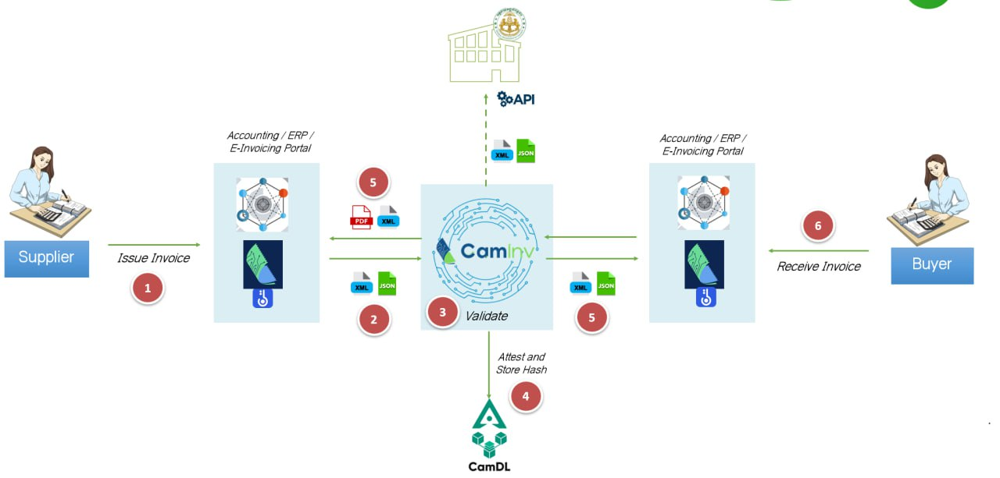

# CamInvoice Introduction

## About

CamInvoice is an electronic invoicing network designed to replace traditional paper-based billing systems and promote interoperability between businesses. Our platform enables businesses to create, send, and receive invoices electronically, optimizing financial workflows, reducing costs and time, and minimizing reliance on physical documents.

Our system is built with robust validation checks and compliance features, adhering to international best practices and relevant laws and regulations. Invoices are transmitted through secure and standardized channels.

This technical documentation provides all the necessary information needed to integrate with our network, assuming you have already contacted us and received your credentials. The documentation is organized into the following sections:

- [Getting Started](./getting-started/getting-start): A guide to help you begin your integration with CamInvoice.
- [API Reference](./document/authentication): Detailed information about our API endpoints.
- [Invoice Structure](./ubl): Specifications on the required formats for invoices and debit/credit notes.
- [Receive Update Event](./receive-update-event): Information on how to configure and use webhooks for receiving notifications.
- [Document Type](./document-type): Details on the various document types supported by CamInvoice.

## How it works

As illustrated above, when a CamInvoice user generates an XML e-invoice using their system or our Free Merchant Portal, they must send the invoice to CamInvoice via our API.

CamInvoice validates the invoice through multiple checks, including XML structure validation, UBL field validation, General Department of Taxation (GDT) rules validation, and e-KYB validation. Once the invoice passes all validations, CamInvoice attests and stores it on the blockchain via CamDL.

After hashing and storing the invoice, CamInvoice triggers a notification to both the sender's and receiver's systems via Webhook.

